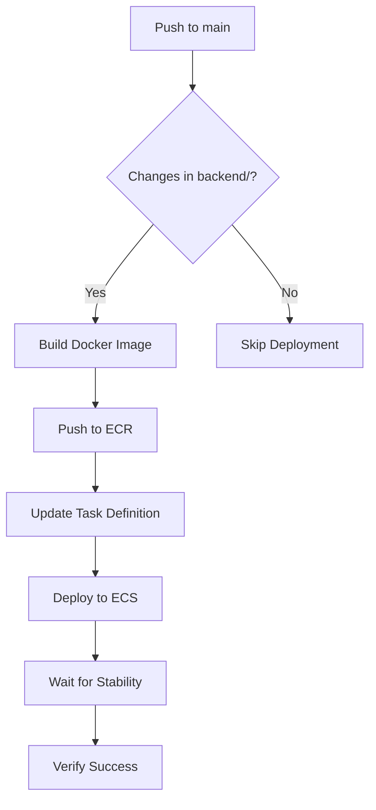
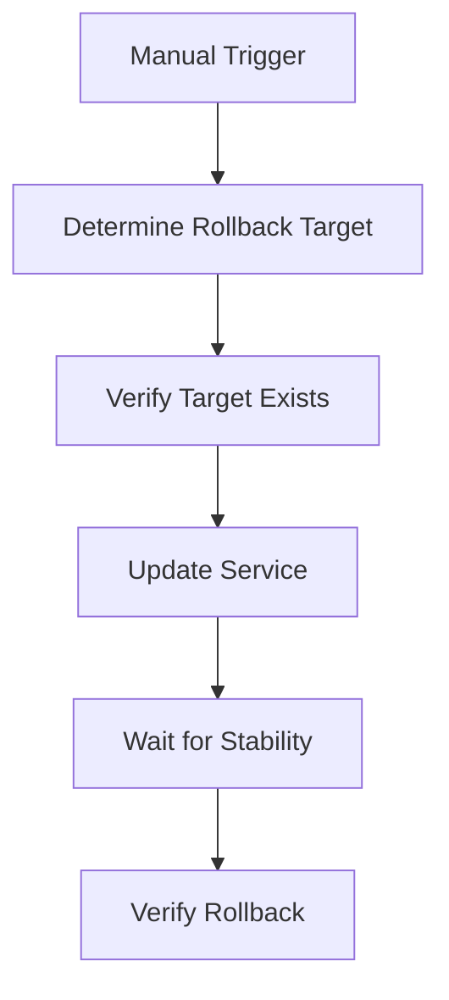

# GitHub Actions Deployment Setup

This repository is configured for automated backend deployment to AWS ECS using GitHub Actions.

## 🚀 Automatic Deployment

### How it works
- **Trigger**: Pushes to `main` branch with changes in the `backend/` directory
- **Process**: Builds Docker image → Pushes to ECR → Updates ECS task definition → Deploys to ECS
- **Zero Downtime**: Uses ECS rolling deployments

### What happens when you push to main:
1. GitHub Actions detects changes in `backend/`
2. Builds new Docker image using `backend/Dockerfile.prod`
3. Pushes image to Amazon ECR with commit SHA as tag
4. Updates ECS task definition with new image
5. Deploys to ECS service with zero downtime
6. Waits for deployment to stabilize
7. Verifies deployment success

## 🔧 Setup Instructions

### 1. Configure GitHub Secrets
Go to your GitHub repository → Settings → Secrets and variables → Actions

Add these secrets:
- `AWS_ACCESS_KEY_ID`: Your AWS access key
- `AWS_SECRET_ACCESS_KEY`: Your AWS secret key

### 2. Update Environment Variables
Edit `.github/workflows/deploy-backend.yml` if your AWS resources have different names:

```yaml
env:
  AWS_REGION: us-east-1                    # Your AWS region
  ECR_REPOSITORY: ai-seo-backend           # Your ECR repository name
  ECS_CLUSTER: ai-seo-cluster              # Your ECS cluster name
  ECS_SERVICE: ai-seo-backend-service      # Your ECS service name
  ECS_TASK_DEFINITION: ai-seo-backend-task # Your task definition name
```

### 3. Required AWS Permissions
Your AWS user/role needs these permissions:
- `ecr:GetAuthorizationToken`
- `ecr:BatchCheckLayerAvailability`
- `ecr:GetDownloadUrlForLayer`
- `ecr:BatchGetImage`
- `ecr:InitiateLayerUpload`
- `ecr:UploadLayerPart`
- `ecr:CompleteLayerUpload`
- `ecr:PutImage`
- `ecs:DescribeTaskDefinition`
- `ecs:RegisterTaskDefinition`
- `ecs:UpdateService`
- `ecs:DescribeServices`

## 📋 Deployment Workflow

### Automatic Deployment Process


### Manual Rollback Process


## 🔄 Rollback Instructions

### Automatic Rollback (to previous revision)
1. Go to GitHub Actions tab
2. Click "Rollback Backend Deployment"
3. Click "Run workflow"
4. Leave revision field empty
5. Click "Run workflow"

### Manual Rollback (to specific revision)
1. Go to GitHub Actions tab
2. Click "Rollback Backend Deployment"
3. Click "Run workflow"
4. Enter the revision number (e.g., "5")
5. Click "Run workflow"

### Find Task Definition Revisions
```bash
aws ecs list-task-definitions --family-prefix ai-seo-backend-task
```

## 📊 Monitoring Deployments

### View Deployment Status
- **GitHub Actions**: Check the Actions tab for deployment logs
- **AWS Console**: ECS → Clusters → ai-seo-cluster → Services → ai-seo-backend-service
- **CloudWatch**: Monitor application logs and metrics

### Deployment Notifications
The workflow provides detailed logs including:
- Build progress
- Image push status
- Task definition updates
- Service deployment status
- Health check results

## 🛠️ Troubleshooting

### Common Issues

**1. ECR Push Fails**
- Check AWS credentials in GitHub secrets
- Verify ECR repository exists
- Ensure AWS user has ECR permissions

**2. Task Definition Update Fails**
- Verify ECS task definition name
- Check if task definition exists
- Ensure AWS user has ECS permissions

**3. Service Update Fails**
- Check ECS cluster and service names
- Verify service is running
- Check task definition is valid

**4. Deployment Timeout**
- Increase timeout in workflow (default: 15 minutes)
- Check ECS service events for errors
- Verify container health checks

### Debug Commands
```bash
# Check service status
aws ecs describe-services --cluster ai-seo-cluster --services ai-seo-backend-service

# View service events
aws ecs describe-services --cluster ai-seo-cluster --services ai-seo-backend-service --query 'services[0].events[0:5]'

# Check task definition
aws ecs describe-task-definition --task-definition ai-seo-backend-task

# View running tasks
aws ecs list-tasks --cluster ai-seo-cluster --service-name ai-seo-backend-service
```

## 🔒 Security Best Practices

1. **Least Privilege**: AWS user has only required permissions
2. **Secrets Management**: AWS credentials stored as GitHub secrets
3. **Image Scanning**: ECR automatically scans images for vulnerabilities
4. **Audit Trail**: All deployments logged in GitHub Actions
5. **Rollback Ready**: Easy rollback to previous versions

## 📈 Performance Benefits

- **Fast Deployments**: Only builds and deploys when backend changes
- **Zero Downtime**: ECS rolling deployments
- **Efficient Resource Usage**: No new infrastructure created
- **Quick Rollbacks**: Instant rollback to previous versions
- **Automated Process**: No manual intervention required

## 🎯 Next Steps

1. Test the deployment by making a small change to backend code
2. Push to main branch and watch the deployment
3. Verify the application is working correctly
4. Practice using the rollback workflow
5. Set up monitoring and alerts for deployment failures 