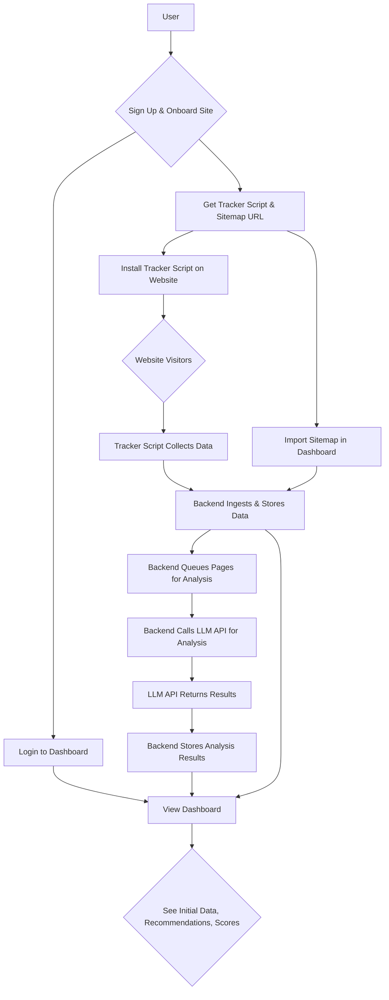
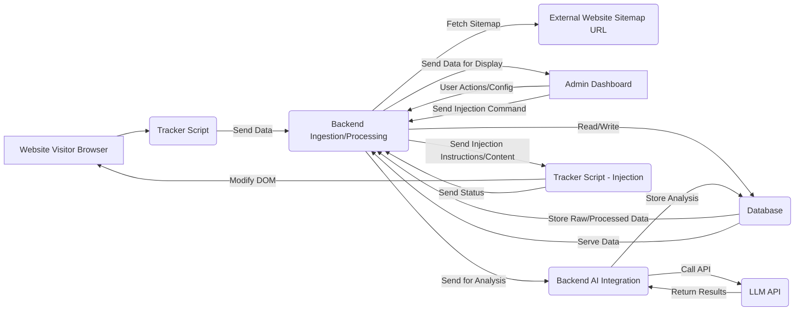

```markdown
# Cleversearch System Flow Documentation

**Version:** 1.0
**Date:** June 25, 2025

---

## 1. Document Header

*   **Version:** 1.0
*   **Date:** June 25, 2025

---

## 2. System Overview

Cleversearch is a web-based platform designed to enhance a website's visibility and citation probability by Large Language Models (LLMs). It operates through three primary components:

1.  **Tracker Script (Client-Side):** A small JavaScript snippet embedded on the user's website pages. It passively collects basic, non-sensitive data such as page URLs, load times, and potentially basic page content/metadata (like title, description, headings, visible text snippets - *configurable for privacy*), sending this data to the Backend.
2.  **Backend:** The central processing unit. It receives data from Tracker Scripts, manages sitemap imports, orchestrates communication with LLM APIs for analysis, stores data (raw and analyzed), and serves data/handles actions requested by the User Dashboard. It contains sub-components for data ingestion, storage, AI integration, and API serving. Snippet generation for the tracker provides minimal configuration (only `SITE_ID`), relying on defaults embedded in the tracker script.
3.  **User Dashboard (Web Application):** The interface where users (Marketing Managers/Founders) interact with the system. They can configure their site, import sitemaps, view processed data, see AI analysis results and recommendations, manage content injection, and monitor key metrics.

**Key Interactions:**

*   Tracker Script streams data *to* the Backend.
*   User Dashboard interacts *with* the Backend (requests data, sends configuration/action commands).
*   Backend processes data, retrieves/stores data from/to the Database, and makes requests *to* external LLM APIs for analysis.
*   Backend sends data or instructions *to* the Tracker Script for content injection.

---

## 3. User Workflows

This section outlines the primary journeys a user takes through the Clever Search system.

**3.1. Initial Setup & Analysis Workflow**

This workflow describes the user's path from signing up to viewing initial analysis results.

1.  **User Signs Up:** Accesses the platform and creates an account.
2.  **User Onboards Site:** Enters website URL and obtains the unique Tracker Script snippet.
3.  **User Installs Tracker Script:** Embeds the snippet in their website's HTML (typically in `<head>` or before `</body>`).
4.  **User Imports Sitemap:** Enters the sitemap URL in the Dashboard.
5.  **Backend Processes Sitemap:** Fetches the sitemap, extracts page URLs, and adds them to the list of pages to track/analyze.
6.  **Tracker Script Starts Sending Data:** As users visit pages, the script sends data to the Backend.
7.  **Backend Ingests & Stores Data:** Receives traffic data and basic content snippets.
8.  **Backend Initiates Analysis:** Periodically or on user trigger, pages (especially new or updated ones) are queued for AI analysis.
9.  **Backend Sends Data to LLM API:** Calls external LLMs with page content/metadata.
10. **LLM API Returns Analysis:** Provides insights, recommendations, and an LLM-readiness score.
11. **Backend Stores Analysis Results:** Saves recommendations and scores in the database.
12. **User Views Dashboard:** Logs in and navigates to the site overview.
13. **User Sees Initial Data:** Views traffic stats, tracked pages, analysis progress, and first recommendations/scores.



**3.2. Reviewing Recommendations & Injecting Content Workflow**

This workflow describes how a user acts on analysis results to improve their site.

1.  **User Views Dashboard:** Logs into the system.
2.  **User Navigates to Recommendations:** Finds the section listing AI-generated recommendations for specific pages.
3.  **User Reviews Recommendations:** Reads the suggestions (e.g., add an FAQ, clarify a section, improve structure).
4.  **User Selects Recommendation for Action:** Chooses a recommendation to implement, often involving suggested content.
5.  **User Confirms Content Injection:** Reviews the AI-suggested content (or edits it) and initiates the injection process via the Dashboard UI.
6.  **Dashboard Sends Injection Command:** The Dashboard signals the Backend which content to inject and on which page.
7.  **Backend Prepares Injection Data:** Formats the content and target information.
8.  **Backend Sends Injection Instructions to Tracker Script:** Queues the injection command for the relevant page/Tracker Script instance.
9.  **Tracker Script Receives Injection Instructions:** On the user's website, the script receives the command (e.g., via a separate poll or WebSocket connection).
10. **Tracker Script Injects Content:** Dynamically modifies the page's DOM to add the content at the specified location.
11. **User Verifies Content:** Visits the page on their website to confirm the content is displayed correctly.
12. **Backend Updates Injection Status:** Marks the recommendation/injection as completed or successful in the database, reflected in the Dashboard.

```mermaid
graph TD
    A[User] --> B[Login to Dashboard];
    B --> C[Navigate to Recommendations];
    C --> D[Review Recommendations & Suggested Content];
    D --> E{Select Recommendation to Act On};
    E --> F[Confirm/Edit & Initiate Content Injection];
    F --> G[Dashboard Signals Backend];
    G --> H[Backend Prepares Injection Data];
    H --> I[Backend Sends Injection Instructions to Tracker Script];
    I --> J{Website Visitor Loads Page};
    J --> K[Tracker Script on Page Receives Instructions];
    K --> L[Tracker Script Injects Content into DOM];
    L --> M[Website Page Updated Visually];
    M --> N[User Verifies Content on Website];
H --> O[Backend Updates Injection Status];
O --> C; %% Flow back to viewing dashboard
```

---

## 4. Data Flows

This section details the movement of data between system components.

1.  **Website Visitors -> Tracker Script:** User interaction triggers the script on the client's browser.
2.  **Tracker Script -> Backend (Ingestion API):** Collects page view data, basic content/metadata snippets, and potentially technical data (browser, OS - *anonymized*), sends via HTTP/S POST request.
3.  **Admin Dashboard -> Backend (Configuration/API):** User inputs (Sitemap URL, injection commands, site settings) sent via HTTP/S requests (GET/POST/PUT).
4.  **Backend (Sitemap Processor) -> External Website (Sitemap URL):** Backend initiates an HTTP/S GET request to fetch the sitemap XML file.
5.  **Backend (Ingestion/Processing) -> Database:** Raw incoming data, processed page information, sitemap structure, configuration settings, user accounts are written to the database.
6.  **Database -> Backend (Data Retrieval):** Backend queries the database to retrieve page data, configuration, analysis results, recommendations, and user information to serve the Dashboard or process.
7.  **Backend (AI Integration) -> LLM API:** Backend constructs API requests containing page content/metadata for analysis, sending them via HTTP/S to the external LLM provider(s).
8.  **LLM API -> Backend (AI Integration):** External LLM provider returns analysis results, scores, and structured recommendations via HTTP/S response.
9.  **Backend (AI Integration) -> Database:** Analysis results, recommendations, LLM scores, and analysis timestamps are written to the database.
10. **Backend (Serving API) -> Admin Dashboard:** Backend formats data from the database and sends it as JSON (or similar) via HTTP/S responses to the Dashboard for display.
11. **Backend (Injection Orchestrator) -> Tracker Script (Injection Channel):** Backend sends commands and content for injection. This could be via a dedicated API endpoint the tracker polls, a WebSocket connection, or embedding instructions within the standard tracker response/configuration.
12. **Tracker Script -> Website DOM:** The script directly manipulates the page's Document Object Model to add, modify, or remove content.
13. **Tracker Script -> Backend (Status Updates):** The script might send back confirmation or error messages regarding injection status.



---

## 5. Error Handling

Robust error handling is crucial for system reliability and user trust, especially given external dependencies (LLMs) and client-side operations (tracker script, injection).

*   **Tracker Script Errors:**
    *   *Issue:* Script fails to load, fails to send data.
    *   *Handling:* Basic logging client-side (if possible), backend identifies missing/stale data for a site/page and flags it in the dashboard. Provide clear instructions for users to verify script installation.
*   **Sitemap Import Errors:**
    *   *Issue:* Invalid URL, sitemap format errors, network issues fetching sitemap.
    *   *Handling:* Validate URL format. Attempt retries for network issues. Parse XML robustly and log errors for invalid entries. Notify the user in the dashboard about import failures and specific errors (e.g., "Invalid XML format", "Could not fetch URL").
*   **Backend Processing Errors:**
    *   *Issue:* Data parsing errors, internal logic errors, database connection issues.
    *   *Handling:* Implement comprehensive server-side logging and monitoring. Use robust data validation. Graceful degradation: if data processing for one page fails, don't stop for others. Implement database connection pooling and retry logic for transient errors. Alert administrators via monitoring tools.
*   **LLM API Errors:**
    *   *Issue:* API downtime, rate limits, authentication failures, invalid requests, unexpected response format.
    *   *Handling:* Implement exponential backoff and retry logic for transient API errors (rate limits, temporary downtime). Validate API responses. Log all API requests and responses (sanitized). If analysis consistently fails for a page, mark it in the dashboard. Notify users if analysis is delayed due to API issues. Provide alternative actions if AI analysis is unavailable (e.g., manual content suggestions).
*   **Database Errors:**
    *   *Issue:* Connection failures, query timeouts, data corruption.
    *   *Handling:* Database monitoring and alerting. Implement robust query error handling in the backend. Use transactions for critical data writes (e.g., saving analysis results). Backup and recovery procedures. Graceful degradation: If read fails, show cached data or an error message in the dashboard; if write fails, retry or queue for later processing.
*   **Content Injection Errors:**
    *   *Issue:* Target element not found, website structure changed, conflicting scripts, network error delivering instructions, script execution failure.
    *   *Handling:* Tracker script should report back injection success/failure status to the backend. Backend updates the status in the database and notifies the user in the dashboard (e.g., "Injection failed for page X, target element not found"). Provide debugging information if possible (e.g., screenshot before failure). Allow users to manually edit the page or try re-injection.
*   **User Dashboard Errors:**
    *   *Issue:* Frontend display issues, API request failures, validation errors on user input.
    *   *Handling:* Client-side validation for user inputs. Clear, user-friendly error messages. Graceful handling of backend API failures (e.g., show a loading indicator, display a "failed to load data" message). Frontend logging for debugging.

---

## 6. Security Flows

Security is paramount, covering data privacy, system integrity, and user access control.

*   **Authentication:**
    *   Users authenticate via username/password (stored securely using hashing and salting) or potentially third-party SSO.
    *   Backend issues secure session tokens or JWTs upon successful login.
    *   All subsequent API requests from the Dashboard must include a valid, non-expired token.
    *   Implement multi-factor authentication (MFA) as an optional or mandatory feature.
    *   Secure password reset process.
*   **Authorization:**
    *   Users are authorized to access data and perform actions only related to the websites/properties associated with their account.
    *   Backend APIs enforce authorization checks on every request (e.g., "Does this user have permission to view/modify data for site ID X?").
    *   Role-based access control if different permission levels are introduced (e.g., Admin vs. Standard User).
*   **Data Security:**
    *   All communication between components (Tracker Script to Backend, Dashboard to Backend, Backend to LLM API, Backend to Database) must use HTTPS/SSL to ensure data is encrypted in transit.
    *   Sensitive data stored in the database (e.g., user passwords, potentially captured page content - depending on privacy policy and configuration) must be encrypted at rest.
    *   Implement strong access controls to the database.
    *   Anonymize or minimize collection of personally identifiable information via the Tracker Script. Clearly define data collection in privacy policy.
*   **Tracker Script Security:**
    *   The Tracker Script should be served securely.
    *   Requests from the Tracker Script to the Backend should be authenticated/authorized, likely using a unique site-specific API key included in the script snippet or requests. The Backend must validate this key.
    *   Injection commands sent from the Backend to the Tracker Script must be signed or include a secure token to prevent malicious injection attempts by third parties manipulating the script on the client-side. The Tracker Script verifies the authenticity of the injection command before executing it.
    *   Limit the scope and permissions of the Tracker Script on the client-side DOM manipulation to prevent broader website defacement.
*   **API Security:**
    *   All Backend APIs exposed to the Dashboard and Tracker Script should be protected.
    *   Implement rate limiting to prevent abuse and denial-of-service attacks.
    *   Sanitize all inputs received from the Tracker Script and Dashboard to prevent injection attacks (SQL injection, XSS).
    *   Regular security audits and vulnerability scanning.

---

## 7. Autonomous Execution Policy

When the user requests to "complete tasks" or similar, the system should execute end-to-end without requiring intermediate confirmations unless blocked by missing credentials or ambiguous requirements.

- Read the Memory Bank first and reconcile with current code.
- Plan → Act in a single session: implement, run lints/build/tests, and fix issues.
- Prefer built-in platform components (e.g., shadcn UI) and Tailwind v4 conventions.
- Do not introduce Docker; use direct processes and Neon PostgreSQL + external Redis.
- Keep tracker script snippets minimal (only `SITE_ID`) and ensure backend endpoints are consistent.
- Update Memory Bank and status after significant changes.

```
